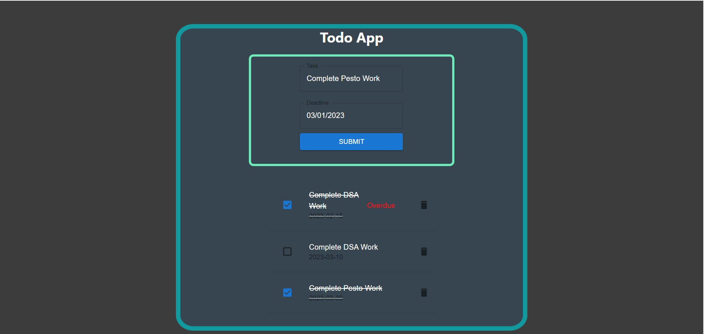

# Getting Started with Create React App
The todo List has been Made using Material UI, React and Context API.

It has the functionality to add and delete the todos, It also shows the tasks that has been over due and the ones that are complete as well.

To Run the project on the local machine 
### `git clone`

from the project link this will download the project in the local folder

### `npm install`
It will install all the packages according to the package.json file attached

Now go to the project directory and.

### `npm start`

Runs the app in the development mode.\
Open [http://localhost:3000](http://localhost:3000) to view it in your browser.

The page will reload when you make changes.\
You may also see any lint errors in the console.

### `npm run build`

Builds the app for production to the `build` folder.\
It correctly bundles React in production mode and optimizes the build for the best performance.

The Project has been deployed on Netlify [Link](https://todolist-aman003malhotra.netlify.app/) You can check it out.

Below is the screenshot attached for the app 
